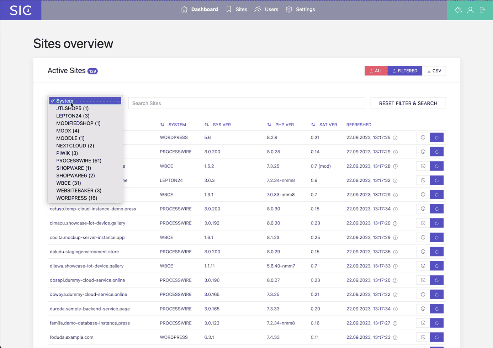
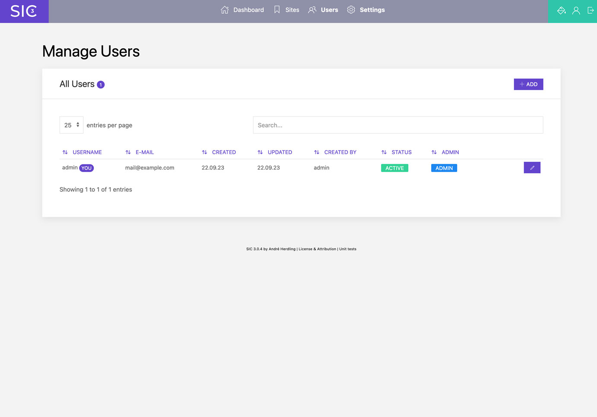

# Site Info Center 3
**Getting information about sites CMS and PHP versions with one click.**

_Site Info Center (SIC) version 3 is based on [SIC LIGHT version 2](https://github.com/digitalbricks/siclight2) but instead of the need for working with config files, SIC 3 has a user interface for managing sites in the browser. SIC 3 is also capable of generating the satellite file, complete with your company contact information and the site specific secret. So the overall workflow is more streamlined. I recommend using version 3 – while version 2 (and version 1) will still do the job._

## Whats the purpose?
If you are a web design / development agency or a freelancer you might be familiar with this scenario:

You have a bunch of sites with a couple of different content management systems and different server configurations under your care. Maybe hosted on different shared servers, managed by your client himself. And you never know exactly which CMS version and which PHP version is currently running on each site without having to maintain an internal list. Sounds familiar?

**Site Info Center (SIC) fetches all that information for you with just one click. You only have to configure your sites once in SIC, place a little PHP file – the so called satellite – on the target server and every time you click SIC's refresh button you get the current version of the CMS and PHP versions in use.**

## Some features
### Refresh information for all sites at once
Get the current CMS and PHP version of all sites with one click. SIC will request the information from the sites satellites and display the results in a table. You can also download the results as CSV file (results from last refresh in a single file or a per-site history of all refreshes).

### Filter by CMS / System
Filter by CMS / system to get the information of all sites using the same Content Management System / eCommerce Plattform or whatever. This may be helpful if you want to know which sites are using a specific CMS / system version. Useful for example when a security update or hotfix is available for the CMS / system in question.

### Search sites
Search for sites by name – very handy when managing a lot of sites or hostnames with a lot of subdomains.

### Manage Sites
Active, inactive, edit, delete, add new sites – all in one place. No need to edit config files anymore.

### Manage User
SIC 3 has a user management and a login. You can add new users, edit existing users and delete users. Unlike the former versions of SIC, you now can have multiple users with their own login credentials. Only useres with admin rights are allowed to add/edit configured sites or users.

### Generate Satellite
SIC 3 will generate the satellite code and offer it for copy or download. Your company contact information and the site specific secret will be added to the satellite code automatically.

### Dark Mode
If you prefer dark mode, SIC 3 has a dark mode. You can switch between light and dark mode in the menu bar.

## Requirements
**SIC** and the required **[SIC Satellite](https://github.com/digitalbricks/sic-satellite)** (more details in short) are written in **PHP**. SIC, the user interface or frontend, uses **SQLite** to store data and **CURL** to communicate with the satellite, so your (local) server running SIC must have CURL installed - which is the case in most environments, especially if you local server is driven by XAMPP or MAMP.

**IMPORTANT NOTE: SIC 3 has, in contrast to SIC LIGHT 2, a user management and a login. But because my profession is the frontend, not backend development and security, it is still not intended to be used on a remote server. At least not now. I made use of [Fat-Free Framework](https://fatfreeframework.com/) (F3) for the routing and the login mechanism but this is my first F3 project so I do not recommend exposing SIC 3 to the internet.**

## How  does it work
**The system is made of two parts:**

* **SIC** (the repo you are watching)

  The part to be placed onto your (local) development server or your NAS where you can reach it with you browser. It provides the user interface and the functionality for fetching information from the sites satellites, managing the sites and displaying the version history.

* **SIC satellite** ([to be found here](https://github.com/digitalbricks/sic-satellite))

  This is a small PHP script you have to place in the root folder of the sites to be monitored. The satellite answers the request of the SIC with information about the CMS and PHP versions currently in use. The satellite in this project comes with a handful functions for getting version info from CMS I was using or I am still using but can be extended with further functions for the CMS you use. More about this later.

In order to prevent the **SIC satellite** to answer all requests and blasting informations into the wild, we are using a **shared secret** which has to be configured with the site in **SIC** and also has to be placed in the **SIC satellite** script.

If you hit the refresh button on the **SIC** user interface, SIC will call the **SIC satellite**, telling him wich CMS it should search for version information (wich function the satellite should run for getting the CMS version) and providing the shared secret. After the satellite has answered, the received information are displayed in the SIC and also stored in a CSV file in `/storage/history` folder. **Yes, CSV**, you could import the CSV files into a spreadsheet tool if you want. SIC also provides a button for **bulk updating** all configured sites and displaying the **version history** of each site with one single click. Of course, you don't have to open the CSV files to get a glimpse at the site information – SIC can display the history of each site in a table.

There will be also a `_summary-latest.csv` created in `/storage/history` folder when you do a bulk update ("Refresh All" button). This file will contain all results of the latest sites information bulk update. You will see an according notification when the refresh queue is finished with a download button.

## Currently supported CMS
As Site Information Center is only responsible for displaying and storing of retrieved information, the SIC satellite controls / limits the supported CMS. You will find an always up to date list of supported systems in the repository of the **[SIC Satellite](https://github.com/digitalbricks/sic-satellite)**. And of course you can add new functions to the satellite if you want.

## Setup / Installation
1. Download the lastes files and folders from this repository
2. Place the files and folders in a folder on your (local) server
3. Make sure the folder `/storage` is writable by the server
4. Call the URL of the folder in your browser
5. Login with the default credentials (admin / admin)
6. Change the default credentials in the user management (this is important! SIC will remind you if you forget it on every login.)

## Add your first Site
1. Login to SIC
2. Click on "Sites" in the menu bar
3. Click on "Add" Button
4. Enter a name for the site (e.g. example.com – this is just for you, so you can identify the site in SIC)
5. (optional) Enter the URL of the site (e.g. https://example.com – just for opening the site right from the SIC 3 dashboard)
6. Enter the System Identifier (e.g. WORDPRESS – see supported systems in [SIC Satellite](https://github.com/digitalbricks/sic-satellite), SIC 3 will provide a dropdown with all supported systems)
7. Set the status to "Active"

Great. No, to get a response from the site when SIC 3 asks for data, you have to create the satellite file and place it on the target server. See next section.

## Configuration: Satellite
SIC 3 will provide you with the satellite code, so you don't have to write it by yourself. Optionally, your contact details can be included in the file - SIC 3 does this automatically as long as the data has been entered under "Settings".
1. (optional) Enter your contact details under "Settings" in the menu bar
2. Click on "Sites" in the menu bar
3. Click on the "Generate Satellite Code" button in the row of the site you want to generate the satellite code for
4. Copy the generated code or download it as a file
5. Place the satellite file in the root folder of the site you want to monitor, make sure the file URL matches the on configured for the site in SIC 3  

## Upgrading Site Info Center 3
1. Make a complete backup of your old installation (just for the case)
2. Download the latest version of SIC 3
3. Delete all folders and files in your SIC 3 folder **except the `storage` directory** (this is important!)
4. Copy the new files and folders into your SIC 3 folder

## Migration from version 1.x, or 2.x to version 3.x
1. Make a complete backup of your old installation (just for the case)
2. Install SIC 3 in a new folder OR using the old, but cleaned up folder (don't forget step 1)
3. Place the `sites-config.php` in the root folder of SIC 3
4. Open SIC 3 in the browser and login
5. SIC 3 will detect the file and ask you if you want to migrate your sitesx
6. Copy your `history` folder from the old installation to the new one (location is `/storage/history` in SIC 3)